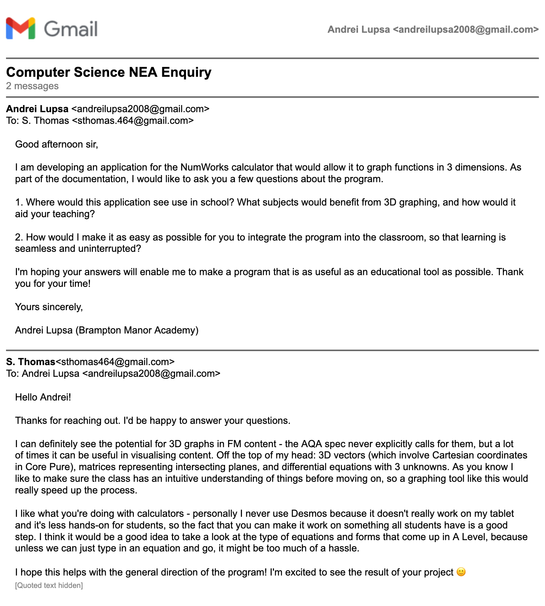

## 1.1 End User

My end users consist of individual students or teachers who want the capability
to graph 3D functions on their own NumWorks calculator, rather than being aimed at schools
or as a product for larger educational bodies.

Therefore, I decided to ask a sixth form teacher at my previous secondary school, Mr. Thomas,
about his needs in a program like this project.
This makes Thomas' opinion on the program useful as both someone with a need for a 3D graphing
application and someone with the most knowledge on how it would be used in a classroom setting.

Here is the email chain between Mr Thomas and I.

The exchange showed me that Mr Thomas considered student participation to be
important to comprehensive understanding of a mathematical topic, so I would
need to make user interaction with the program intuitive and sleek. 

However, I would have to be careful in implementing the function parsing and 
graph generation logic so that it would be compatible with the style of question
or content given at A Level. 

I have made an attempt to involve the specification in my design decisions, as
well as designing the program with student and teacher users in mind.

