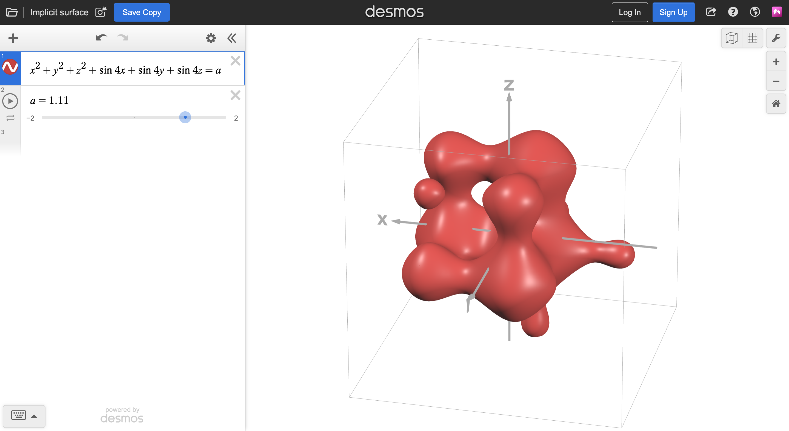
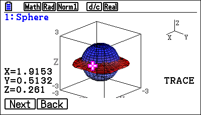
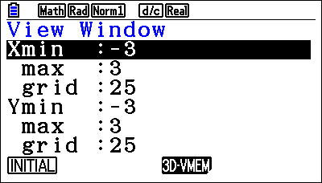
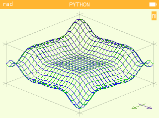

## 1.2 Current solutions

The capability of graphing in 3 dimensions is very desired of a graphing calculator
by educators and students of calculus,
and as such many attempts have been made to provide the NumWorks calculators with
this functionality. However, due to the limited capabilities of embedded hardware
and the complexity of implicit graphs, these existing solutions fail to meet all
the requirements of my end user.

### Non-calculator solutions

**Desmos 3D**

Desmos, a website that host free maths tools, has a beta test of a 3D graphing
program to go alongside their 2D grapher. Built on the same system as the 2D grapher,
it is smooth and feature-complete, and runs on most browsers using JavaScript.

The user experience is natural, with a comprehensive feature set including variable
sliders and animation, possible due to the capability of computer hardware. The program
also offers several QOL features like custom colouring, domains, and labels for different
functions. Graph manipulation takes keyboard & mouse input for ease of use.

The program is capable of plotting implicit graphs, although it can trip up on complex
surfaces involving tangents and undefined points. This may be a vulnerability of the
[marching cubes](#algorithms) algorithm.

[Link](https://www.desmos.com/3d)

### FX-CG50 3D Graph

The Casio fx-CG50 calculator has an official application for 3D graphing. Although
the application comes installed with the calculator, it is not part of the suite of
built-in apps and needs to be reinstalled manually as an add-in from a computer if
the calculator is reset or crashes.

The application can only graph certain types of 3D graphs, limited to primitives 
such as spheres, cones, planes and cylinders. However, it allows the user to trace 
each function drawn, as well as rotating and scaling the viewport. Translating the 
graph is unintuitive, done numerically via the View Window. Graphs and points are 
saved between sessions so that the same graph only needs to be calculated once.

The fx-CG50 3D Graph app exemplifies what the user experience should look like when
displaying the graph, although a few of the graph manipulation methods are not very 
user-friendly. Despite this, it is limited in capability with regards to explicit and 
implicit functions despite the fx-CG50's 2D grapher having support for those. Functions
cannot be inputed by the user, and must instead be selected from a list of presets with parameters,
restricted to shapes like spheres/spheroids, cones and toruses.

The program only functions on the fx-CG50 and is not compatible with any other calculators.

[Link](https://education.casio.co.uk/support/os-files/os-files-cg50-add-ins/)

### NumWorks Workshop

NumWorks provides an online service where users can share Python scripts under their
NumWorks accounts, available at the domain [my.numworks.com][]. <!-- TODO: link -->

These solutions, while written for the MicroPython interpreter rather than the native
operating system of the calculator, emulate closest what I am attempting to
accomplish.  
Workshop programs run within the environment of the calculator, and as such operate
under the same memory, processing, display and input constraints that my program
will have. The user experience is the same and the end users are identical;
therefore, analysing these programs closely is one of the more accurate market
research methods I have available.

**mty's `draw_3d_graph`** 

draw_3d_graph is a Python script written for NumWorks' MicroPython implementation.
It takes an explicit function $z = f(x, y)$ written at the end of the script and 
graphs it with a wireframe representation. The wireframe rasterisation of the graph
paints almost instantly despite using Python Kandinsky, so the viewing experience 
is smooth with minimal input delay.

The program allows tracing and translation of the graph domain by switching between
two modes, using intuitive D-pad controls. These controls only function in the x and
y dimension, so the z-coordinate is fixed and may sometimes result in points not 
appearing in the domain. The graph's orientation is statically isometric. The interface
makes it clear where the domain lies, what mode the program as in, and which directions
represent each axis.

Overall, the Python script presents a functional, yet limited 3D grapher, constrained 
in graph manipulations and the range of graphs which it can plot. The program is nevertheless
easy to use, aside from the need to edit the script to change the function.

Despite this, the speed of graphing in the program, and the fact that it only supports explicit
graphs at a low resolution in a fixed domain, means it is completely useless for arbitrary
functions that show up in advanced mathematics classes.

[Link](https://my.numworks.com/python/mty/draw_3d_graph)

**vnap0v's `surf3d`**

surf3d is a Python script written for NumWork's MicroPython implementation. It is
very similar to [draw_3d_graph](#mtys-draw_3d_graph-link), with two noticeable 
differences: the graph is of a significantly higher resolution, with proximity 
shading; and the graph image is completely static.

The program lacks any way of interacting with or manipulating the graph, yet 
it still shows a prime example of how to present the graph visually to the user.
The use of shading makes it clearer where points lie relative to the camera, 
reducing visual clutter. Some elements of this program's visual design will be
useful to incorporate into my program.

[Link](https://my.numworks.com/python/vnap0v/surf3d)

