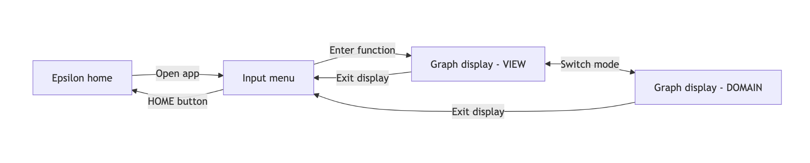

## 1.9 Modelling

The grapher will need to take input and produce a graph from said input; therefore,
the top-level data flow can be viewed as a simple menu/interaction system. The process
is modelled as closely as possible to the principles used in NumWorks' own native apps,
in accordance with the projects goal to produce a near-seamless educational experience.

Possibly important to note is that the growth of the size of octrees (considered in 
3 dimensional grid-related programs which may be of use to my program) is modelled as
$\mathcal{O}(n^3)$. This might affect things like the time complexity of algorithms used
or memory required, and may influence how I design the data structures used to store
3D lattice information.
