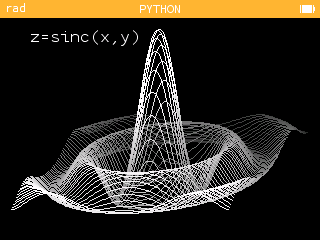
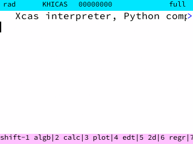
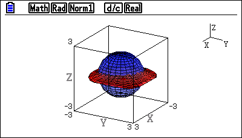
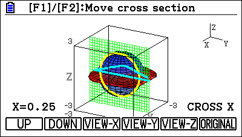

## 1.2 Current solutions

<!-- Desmos?? -->

The capability of graphing in 3 dimensions is very desired of a graphing calculator, and as such many attempts have been made to provide the NumWorks calculators with this functionality. However, due to the limited capabilities of embedded hardware and the complexity of implicit graphs, these existing solutions fail to meet all the requirements of my end user.

### mty's draw_3d_graph ([Link](https://my.numworks.com/python/mty/draw_3d_graph))

draw_3d_graph is a Python script written for NumWorks' MicroPython implementation. It takes an explicit function $z = f(x, y)$ and graphs it 

### vnap0v's surf3d ([Link](https://my.numworks.com/python/vnap0v/surf3d))

surf3d is a Python script written for NumWork's MicroPython implementation.

### Adi-df's Complex Numworks ([Link](https://github.com/Adi-df/complex-numworks))

> The compiled .nwa in the [latest release](https://github.com/Adi-df/complex-numworks/releases/tag/0.2.0) doesn't load to the calculator and has a size of NaN KB.

<!-- TODO: build it yourself -->

Complex Numworks is a compiled Rust application for the NumWorks calculators distributed as an .nwa file.

### yannis300307's NumcraftRust ([Link](https://github.com/yannis300307/NumcraftRust))

NumcraftRust is a compiled Rust application for the NumWorks calculators distributed as an .nwa file. It is not a 3D graphing program at all, but it accomplishes the same task of a 3D rendering engine operating within the limited hardware of the NumWorks calculators. The application is an implementation of a basic cube sandbox game with movement, building and breaking mechanics.

The game runs at an average of 20 FPS on the N0100 and N0110, and at 50 FPS on the N120. This remains relatively stable even with thousands of polygons on the screen. Screen tearing is minimal and frames are drawn smoothly with no flickering. Various optimisations mean the application runs responsively enough for a positive user experience.

While its accomplishments are similar to what a 3D grapher should do, it obviously has no 3D graphing functionality. The purpose of the program is very different yet it still provides a solution to one of the problems faced by this project.

### KhiCAS/XCAS ([Link](https://www-fourier.univ-grenoble-alpes.fr/~parisse/numworks/nws_en.html))

KhiCAS is a small, yet powerful Computer Algebra System that was ported to the NumWorks calculators <!-- by whom? --> as an app with a custom installation protocol. It implements its own mathematical statement parsing system.

### FX-CG50 3D Graph ([Link](https://education.casio.co.uk/support/os-files/os-files-cg50-add-ins/))

 

 

 

 

The Casio fx-CG50 calculator has an official application for 3D graphing. Although the application comes installed with the calculator, it is not part of the suite of built-in apps and needs to be reinstalled manually as an add-in from a computer if the calculator is reset or crashes.

The application can only graph certain types of 3D graphs, limited to primitives such as spheres, cones, planes and cylinders. However, it allows the user to trace each function drawn, as well as rotating and scaling the viewport. Translating the graph is unintuitive, done numerically via the View Window. Graphs and points are saved between sessions so that the same graph only needs to be calculated once.

The fx-CG50 3D Graph app exemplifies what the user experience should look like when displaying the graph, although a few of the graph manipulation methods are not very user-friendly. Despite this, it is limited in capability with regards to explicit and implicit functions despite the fx-CG50's 2D grapher having support for those. The program only functions on the fx-CG50 and is not compatible with any other calculators.

### Desmos 3D ([Link](https://www.desmos.com/3d))

Desmos, a website that host free maths tools, has a beta test of a 3D graphing program to go alongside their 2D grapher. Built on the same system as the 2D grapher, it is smooth and feature-complete, and runs on most browsers using JavaScript.

The user experience is extremely positive, with a large feature set including variable sliders, animation and possible due to the capability of computer hardware. The program also offers several QOL features like custom colouring, domains, and labels for different functions. Graph manipulation is intuitive using keyboard & mouse controls.

The program is capable of plotting all kinds of graphs, including implicit functions, although it can trip up on complex surfaces involving tangents and undefined points.
